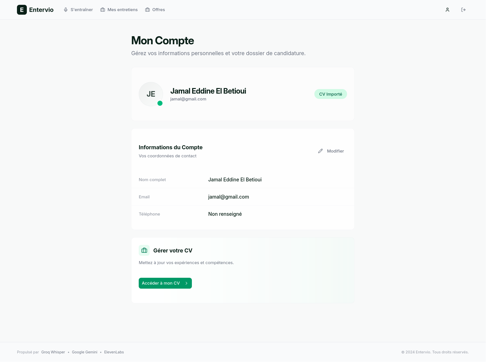
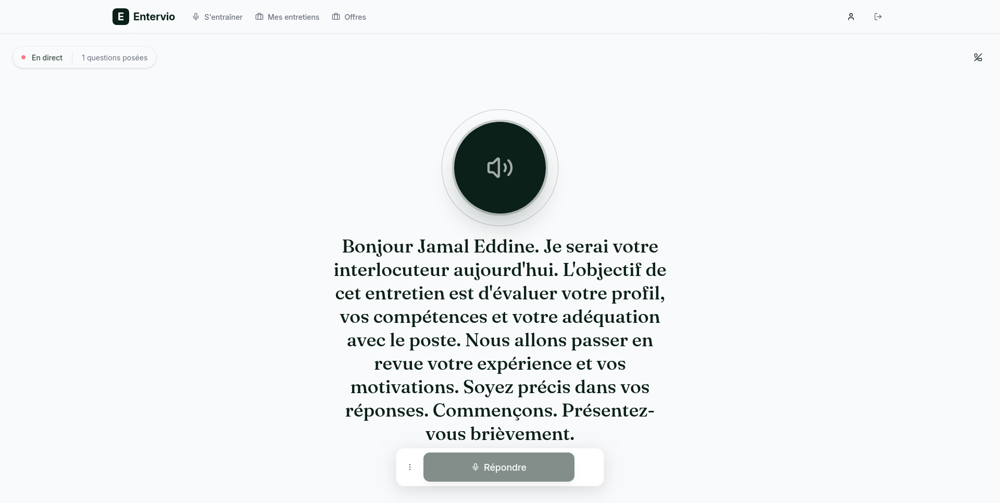
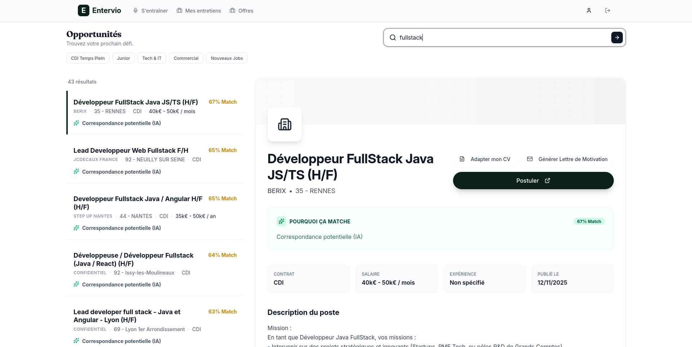

# Entervio 🎙️

**The Ultimate AI Career Copilot**  
*Master your interview skills, build the perfect resume, and land your dream job.*

Entervio is a comprehensive, full-stack platform designed to give candidates an unfair advantage. It combines **real-time voice AI** for mock interviews, **Typst-powered** resume generation, cover letter generation, and integrated job search tools into a single, modern interface.



## ✨ Core Features

### 1. Unified Dashboard
A modern, responsive interface built to manage your entire job search process.

### 2. AI & Cloud Stack
The platform leverages a high-performance mix of state-of-the-art AI models:

- **LLM (Intelligence)**: **Groq** (running **Llama 3.3 70B**) provides near-instant cognitive reasoning for interview questions and grading.
- **Embeddings (Search)**: **Google Gemini** (`text-embedding-004`) powers the semantic search and job reranking system.
- **Speech-to-Text (STT)**: **Groq** (Whisper Large v3) ensures ultra-fast, accurate transcription of your voice.
- **Text-to-Speech (TTS)**: **ElevenLabs** (Turbo v2.5) delivering ultra-realistic voice feedback (with **EdgeTTS** as a zero-cost fallback).
- **Data Integration**: **France Travail API** for real-time, official French job market data.



### 3. Technical Architecture

#### Frontend (Modern React)
- **Framework**: React 18, Vite, React Router 7.
- **Styling**: Tailwind CSS + Shadcn UI + Lucide Icons.
- **State**: Zustand for global store management.
- **Auth**: Supabase.

#### Backend (High-Performance Python)
- **Framework**: **FastAPI** (Python 3.10+).
- **Package Manager**: **uv** (An extremely fast Python package installer).
- **Database**: SQLAlchemy (Async) + Alembic migrations + SQLite/PostgreSQL.
- **Document Gen**: **Typst** for professional, code-driven PDF rendering.



---

## 🚀 Getting Started

### Prerequisites
- **Python 3.10+** and **[uv](https://github.com/astral-sh/uv)** (Required for backend).
- **Node.js 18+** (Required for frontend).
- API Keys:
  - **Groq** (Required for LLM & STT)
  - **Google Gemini** (Required for Embeddings)
  - **France Travail** (Required for Job Search)
  - **Supabase** (Required for Auth)
  - **ElevenLabs** (Optional, for premium voice)

### 1. Backend Setup

The backend uses `uv` for lightning-fast dependency management.

```bash
git clone https://github.com/AnasChhilif/entervio.git
cd back

# Create virtualenv and install dependencies
uv sync

# Activate the virtual environment
source .venv/bin/activate  # Windows: .venv\Scripts\activate

# Setup environment variables
cp .env.example .env
# ⚠️ Edit .env with your API keys (GROQ_API_KEY, GEMINI_API_KEY, etc.)

# Run the server
uv run uvicorn app.main:app --reload --port 8000
```

### 2. Frontend Setup

```bash
cd front

# Install dependencies
npm install

# Start the development server
npm run dev
```

The application will be available at `http://localhost:3000`.

## 🐳 Docker Deployment

For a production-ready containerized environment:

```bash
docker compose up --build
```

---

## 🤝 Credits

**Entervio** is a collaborative engineering project built by:
* **[Anas Chhilif](https://github.com/AnasChhilif)** 
* **[Jamal Eddine El Betioui](https://github.com/JamalEddineEb)**

---

*Note: This project is for educational and portfolio purposes. All AI features require valid API keys from their respective providers.*
