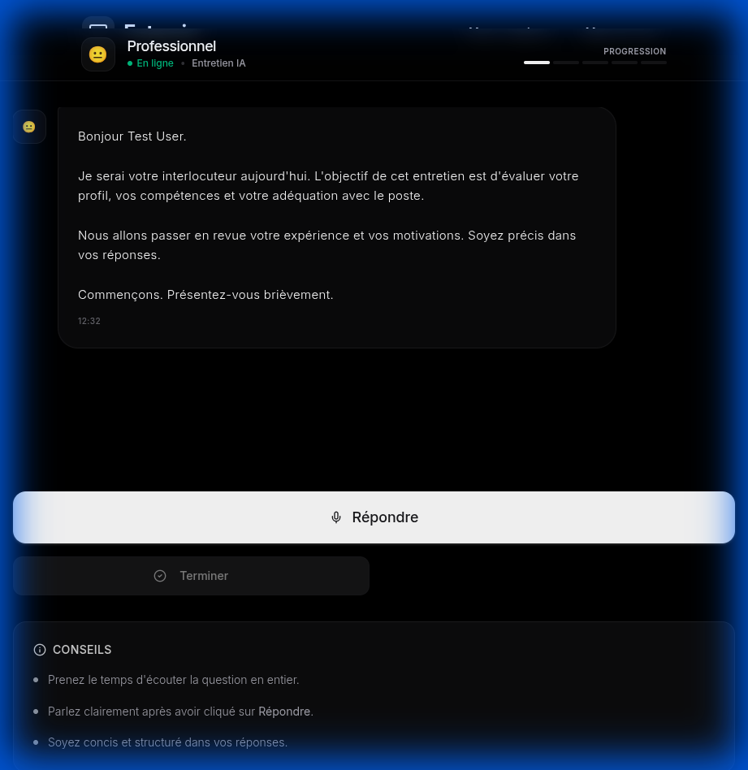
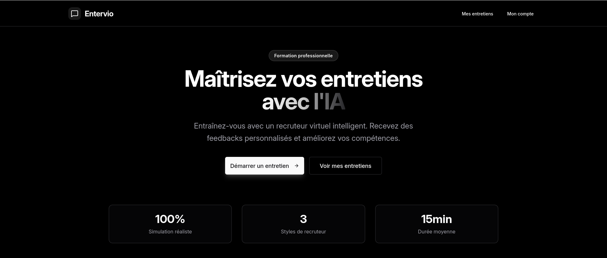
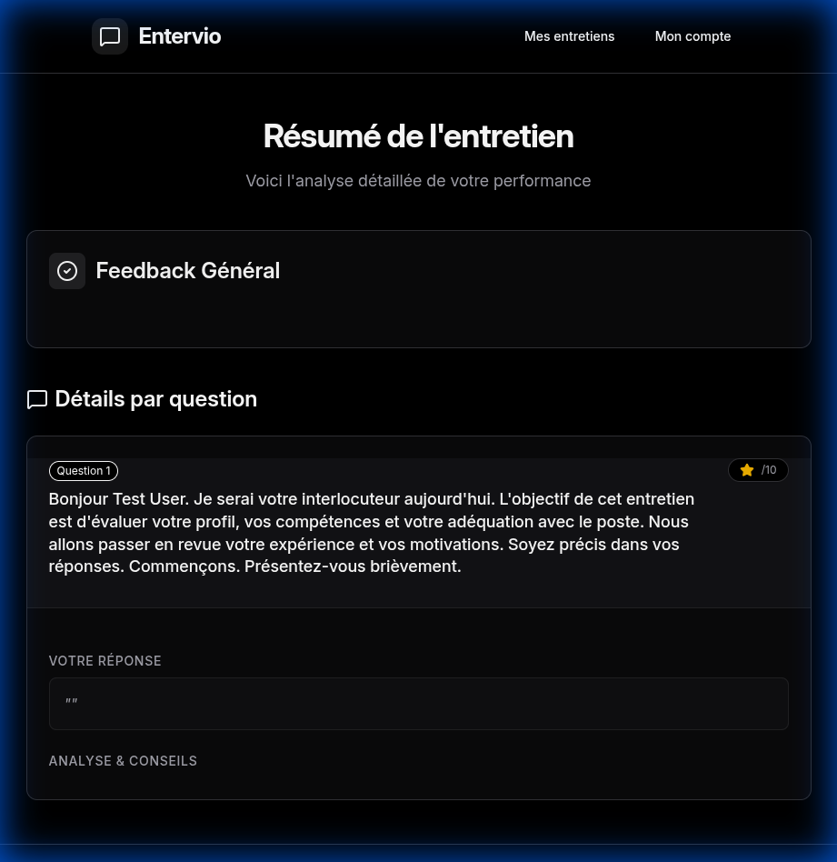

# Entervio 🎙️

**AI-Powered Voice Interview Platform**

Entervio is a modern, full-stack application that simulates realistic job interviews using AI. It features a sleek, minimalist design, real-time voice interaction, and comprehensive feedback to help candidates improve their skills.



## ✨ Features

-   **🤖 AI Interviewer**: Powered by LLMs to conduct dynamic, context-aware interviews.
-   **🗣️ Real-time Voice Interaction**: Seamless speech-to-text and text-to-speech for a natural conversation flow.
-   **🎨 Sleek & Minimalist UI**: A distraction-free, "Clean & Light" aesthetic designed for focus.
-   **📝 Job Context**: Customize the interview based on specific job descriptions.
-   **📊 Detailed Feedback**: Receive comprehensive grading and actionable advice after every session.
-   **🎭 Configurable Personas**: Choose from different interviewer styles (Neutral, Friendly, Strict).

## 📸 Screenshots

| Setup | Feedback |
|:---:|:---:|
|  |  |

## 🛠️ Tech Stack

-   **Frontend**: React (Vite), Tailwind CSS, Lucide Icons
-   **Backend**: Python (FastAPI), SQLAlchemy, SQLite
-   **AI/ML**: Gemini, ElevenLabs/Edge (TTS), Whisper (STT)

## 🚀 Quick Start

### Prerequisites
-   Python 3.11+
-   Node.js 18+
-   API Keys (Gemini, ElevenLabs, Groq, Supabase)

### Backend Setup

```bash
git clone https://github.com/AnasChhilif/entervio.git
cd back
python -m venv .venv
source .venv/bin/activate  # or .venv\Scripts\activate on Windows
pip install -r requirements.txt
cp .env.example .env
# Edit .env with your API keys
uvicorn app.main:app --reload --port 8000
```

### Frontend Setup

```bash
cd front
npm install
npm run dev
```

The application will be available at `http://localhost:3000`.

## 🐳 Docker Support

Run the entire stack with a single command:

```bash
docker compose up --build
```

## 🤝 Credits

**Entervio** is a collaborative project built by:

* **[Anas Chhilif](https://github.com/AnasChhilif)** 
* **[Jamal Eddine El Betioui](https://github.com/JamalEddineEb)**
